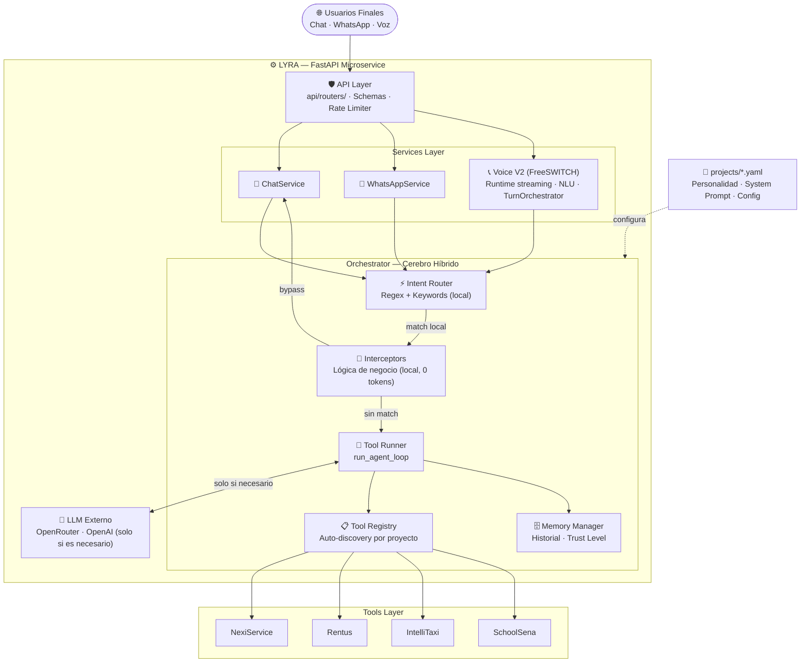

<div align="center">

<br/>

<h1>✦ LYRA</h1>

<h3>Generative AI Orchestration Engine</h3>

_Motor de orquestación generativa — agnóstico, escalable, orientado a producción_

<br/>


<br/>

</div>

---

## Visión General

**Lyra** es un microservicio de inteligencia artificial generativa diseñado con un único principio rector: que ningún dominio de negocio deba reinventar su propio motor de IA. Construido sobre **FastAPI** y Python 3.10+, proporciona una plataforma unificada y de baja latencia para la ejecución de agentes autónomos con capacidades de razonamiento iterativo, _tool calling_ nativo y gestión de contexto conversacional persistente.

Los proyectos no se definen en código, **se definen en YAML**. Cada despliegue corporativo vive como un perfil declarativo independiente, lo que permite incorporar nuevos casos de uso sin tocar el núcleo del motor.

### Motor de IA Híbrido

Lyra no depende exclusivamente de un LLM externo. Opera con una **arquitectura de dos cerebros**:

**Cerebro Rápido (Local)** — La mayoría de las consultas transaccionales son resueltas localmente por Lyra sin consumir tokens ni introducir latencia de red. Esto incluye:
- Clasificación de intenciones mediante un motor determinista de **Regex + Keywords** (`intent_router.py`)
- Resolución directa de búsquedas, servicios y agendamientos mediante **Interceptores por proyecto** (`interceptors/`)
- Para NexiService, aproximadamente el **70–80% de las consultas** se resuelven en este nivel

**Cerebro Lento (LLM Externo)** — Solo se activa cuando la intención es ambigua, el usuario se sale del flujo estándar o la tarea requiere razonamiento complejo. El proveedor configurable es **OpenRouter** (por defecto) u **OpenAI** como alternativa. Ambos se consumen vía el SDK estándar de OpenAI.

```
Consulta del usuario
      ↓
  intent_router     ← Regex/Keywords (local, 0 tokens)
      ↓
  interceptor       ← Lógica de negocio (local, 0 tokens)
      ↓ (si no hay match)
  LLM externo       ← OpenRouter / OpenAI (solo cuando es necesario)
```

### Proyectos en Producción

| Proyecto | Dominio | Canal |
|---|---|---|
| **NexiService** | Directorio comercial interactivo con búsqueda, comparación de negocios y control de mapas | Chat (Web / Mobile) |
| **Rentus** | Asistente inmobiliario con búsqueda geoespacial, negociación y agendamiento de visitas | Chat (Web / Mobile) |
| **IntelliTaxi** | Operadora telefónica con STT en tiempo real, geocodificación semántica y despacho autónomo | FreeSWITCH Voice |

---

## Arquitectura del Sistema



---

## Estructura del Proyecto

```
lyra-ai/
│
├── main.py                              # Bootstrap · Lifespan · Registro de routers
├── requirements.txt
│
├── api/                                 # ── Capa de Transporte (HTTP) ─────────────────────────────
│   ├── dependencies.py                  # Inyección de dependencias (DB, Services, Registries)
│   ├── middleware.py                    # Rate limiting por sesión/cliente
│   ├── routers/
│   │   ├── main.py                      # POST /chat
│   │   ├── freeswitch.py                # WS /freeswitch/audio (full-duplex) · /recording · /health
│   │   ├── whatsapp.py                  # GET|POST /whatsapp
│   │   ├── browser_voice.py             # WebSocket voz desde navegador
│   │   ├── tts.py                       # Sirve audios TTS generados
│   │   └── admin/
│   │       ├── config.py                # /admin/status · /health · /config
│   │       ├── sessions.py              # /admin/sessions
│   │       └── stats.py                 # /admin/stats · /stats/intents
│   └── schemas/
│       ├── chat.py                      # ChatRequest · ChatResponse
│       └── common.py                    # HealthResponse · ProjectResponse
│
├── services/                            # ── Capa de Negocio ───────────────────────────────────────
│   ├── chat_service.py                  # Mensajes · historial · trust level
│   ├── whatsapp_service.py              # Máquina de estados · Meta API
│   ├── geo.py                           # Proxy de geocodificación (CORS/API keys)
│   ├── voice/                           # Lyra Voice V2 — motor conversacional streaming
│   │   ├── runtime.py                   # Composición full-duplex por llamada
│   │   ├── transport.py                 # WS mod_audio_stream (frames + playback streamAudio)
│   │   ├── stt_stream.py                # Deepgram nova-2 streaming (parciales + keywords)
│   │   ├── endpointing.py               # Endpointing híbrido acústico + semántico
│   │   ├── nlu.py                       # Extracción de spans (structured outputs)
│   │   ├── orchestrator.py              # FSM de negocio (estados V1 preservados)
│   │   ├── tts_stream.py                # edge-tts incremental por oración + caché
│   │   ├── aec.py                       # Cancelación de eco NLMS (lado servidor)
│   │   ├── barge_in.py                  # Clasificador interrupción vs backchannel
│   │   ├── recorder.py                  # Grabación de llamada mezclada server-side
│   │   └── filters.py                   # Anti-alucinación STT · anti-eco textual
│   └── telephony/                       # Contratos de negocio del canal de voz
│       ├── session_store.py             # Sesiones de llamada (memoria/Redis)
│       ├── backend_client.py            # Cliente al backend Laravel (IntelliTaxi)
│       ├── esl_client.py                # Cliente ESL (uuid_kill)
│       ├── idempotency.py               # Guard de creación de servicio por call_uuid
│       ├── ffmpeg_bin.py                # Resolución del binario ffmpeg
│       └── phone_utils.py               # Normalización de números telefónicos
│
├── orchestrator/                        # ── Motor de Orquestación ─────────────────────────────────
│   ├── tool_runner.py                   # run_agent_loop · árbitro local vs LLM
│   ├── tool_registry.py                 # Registro dinámico · auto-discovery
│   ├── tool_adapter.py                  # LegacyToolAdapter — migración gradual
│   ├── intent_router.py                 # Clasificación determinista (Regex/Keywords)
│   ├── context_builder.py               # System prompt · contexto del usuario
│   ├── memory_manager.py                # Sesiones y perfiles en MySQL
│   ├── response_engine.py               # Post-procesamiento de respuestas
│   └── interceptors/
│       ├── manager.py                   # Orquestador de interceptores
│       ├── nexiservice.py               # Bypass local para NexiService (~70-80% queries)
│       └── schoolsena.py                # Bypass local para SchoolSena
│
├── tools/                               # ── Integraciones con APIs Externas ──────────────────────
│   ├── nexiservice.py                   # search_businesses · fly_to_business · comparaciones · ...
│   ├── rentus.py                        # Propiedades · agendamiento · geocodificación
│   ├── intellitaxi.py                   # Órdenes · coordenadas · backend Laravel
│   ├── navigation.py                    # Navegación programática en la UI
│   ├── schoolsena.py                    # Agendamiento académico SchoolSena
│   └── shared/
│       └── utils.py                     # normalize_text · haversine · parse_date · ...
│
├── core/                                # ── Núcleo y Recursos Compartidos ────────────────────────
│   ├── config.py                        # Variables de entorno (pydantic-settings)
│   ├── database.py                      # Pool de conexiones MySQL
│   ├── llm_engine.py                    # Cliente LLM async · OpenRouter / OpenAI
│   ├── logger.py                        # Logging centralizado con rotación
│   ├── pusher.py                        # Eventos en tiempo real
│   ├── voice_engine.py                  # TTS con edge-tts
│   ├── location_match.py                # Resolución tipada de ubicaciones (precision-first)
│   ├── geocoder_service.py              # Pipeline geocodificación: Cache→Google→Nominatim
│   ├── geo_types.py                     # LocationType · ResolutionStatus · GeoCandidate
│   ├── address_utils.py                 # NLP/STT: normalización de direcciones colombianas
│   ├── stt_enhancer.py                  # Motor de mejora STT (fonética, contracciones payanesas)
│   └── conversation_repair.py           # Barge-in · reparación conversacional
│
├── docs/                                # ── Documentación técnica (freeswitch/, voice/, geocoding/)
│
└── projects/                            # ── Perfiles Declarativos por Proyecto ───────────────────
    ├── nexiservice.yaml
    ├── rentus.yaml
    ├── intellitaxi.yaml
    └── schoolsena.yaml
```

---

## Stack Tecnológico

| Tecnología | Rol |
|---|---|
| **Python 3.10+** | Lenguaje base |
| **FastAPI** | Framework REST/WebSocket asíncrono |
| **Uvicorn** | Servidor ASGI |
| **OpenRouter** | Proveedor LLM externo principal (compatible OpenAI) |
| **openai SDK** | Cliente de comunicación estándar con el LLM |
| **httpx** | Cliente HTTP asíncrono para tool calls |
| **PyMySQL** | Driver MySQL/MariaDB |
| **pydantic-settings** | Configuración tipada por entorno |
| **PyYAML** | Carga de perfiles de proyecto en runtime |
| **FreeSWITCH + mod_audio_stream** | Gateway telefónico — WS streaming full-duplex |
| **Deepgram (nova-2)** | STT streaming telefónico (parciales + endpointing + keywords) |
| **openai (gpt-4o-mini)** | NLU de turno (structured outputs) y chat |
| **edge-tts** | Generación de voz (TTS) streaming por oración |
| **pusher** | Eventos en tiempo real hacia el frontend |

---

## Despliegue y Configuración

### Requisitos previos

- Python `3.10` o superior
- MySQL activo (XAMPP o instancia local)
- Servidor FreeSWITCH con `mod_audio_stream` (ver `docs/freeswitch/STREAMING_DEPLOY.md`) _(solo para IntelliTaxi)_

> **API Keys** — Contacta a [@miguelcamilok](https://github.com/miguelcamilok) para obtener credenciales.

---

### Paso 1 — Base de Datos

1. Crea una base de datos `lyra_db` con colación `utf8mb4_unicode_ci`
2. Ejecuta las migraciones en orden:

```bash
migrations/001_initial.sql   # usuarios, conversaciones, mensajes
migrations/002_admin_tables.sql  # configuración, alertas, logs admin
```

---

### Paso 2 — Variables de Entorno

**Solicitar a [@miguelcamilok](https://github.com/miguelcamilok) el archivo `.env` del proyecto.**

---

### Paso 3 — Entorno Virtual y Dependencias

```bash
pip install -r requirements.txt
```

---

### Paso 4 — Iniciar Lyra

```bash
python main.py
```

```
✓ Model loaded and ready
✓ Lyra running on http://0.0.0.0:8099
```

> Si hay conflicto de puerto en Windows:
> ```powershell
> taskkill /F /IM python.exe; Start-Sleep -s 1; python main.py
> ```

---

### Paso 5 — Verificar

```
GET http://localhost:8010/admin/health
```

Respuesta esperada: JSON con todos los servicios en `"status": "healthy"`.

---

## Cómo Agregar un Nuevo Proyecto

**1. Crear el perfil YAML** en `projects/mi_proyecto.yaml`

```yaml
project_id: mi_proyecto
assistant_name: "Nombre del Asistente"
system_prompt: |
  Eres un asistente especializado en...
tools:
  - search_products
llm:
  model: openai/gpt-4o-mini
  temperature: 0.4
```

**2. Crear el módulo de tools** en `tools/mi_proyecto.py`

```python
TOOL_NAME = "search_products"

TOOL_SCHEMA = {
    "type": "function",
    "function": {
        "name": "search_products",
        "description": "Busca productos en el catálogo.",
        "parameters": {
            "type": "object",
            "properties": {
                "query": {"type": "string"}
            },
            "required": ["query"]
        }
    }
}

async def execute(params: dict, context: dict) -> dict:
    # lógica de integración...
    return {"result": [...], "error": None}
```

**3. Registrar en el lifespan** de `main.py`

```python
app.state.registries["mi_proyecto"] = ToolRegistry.for_project("mi_proyecto")
```

**4. (Opcional) Crear interceptor** para manejo local sin LLM

```python
# orchestrator/interceptors/mi_proyecto.py
class MiProyectoInterceptor(BaseInterceptor):
    async def pre_llm(self, intent, args, context):
        if intent == "saludo":
            return {"reply": "¡Bienvenido!", "bypass": True}
        return None
```

---

## Panel de Administración

| Endpoint | Función |
|---|---|
| `GET /admin/health` | Estado de todos los servicios |
| `GET /admin/stats` | Métricas, latencias y errores por proyecto |
| `GET /admin/sessions` | Auditoría de conversaciones |
| `POST /admin/config` | Actualización en caliente de parámetros LLM |

---

## Convenciones de Desarrollo

- **Thin Routers** — Los routers solo reciben/responden HTTP. Toda lógica va en `services/`
- **Contrato de Tools** — Cada tool expone `TOOL_NAME`, `TOOL_SCHEMA` y `async def execute(params, context)`
- **Local primero** — Si una intención puede resolverse sin LLM, va en un interceptor
- **Logging centralizado** — Nunca `print()`, siempre `get_logger(__name__)`
- **Asincronía total** — `async def` para todo I/O, `httpx` en lugar de `requests`

---

## Desarrollado por

<div align="center">

| | Desarrollador | GitHub |
|---|---|---|
|  | **Miguel Camilo** | [@miguelcamilok](https://github.com/miguelcamilok) |
|  | **Jeferson Martinez** | [@jefermar](https://github.com/jefermar) |

<br/>

---

<sub>© 2026 VΞX — Lyra AI Engine · Documento Técnico Privado · Todos los derechos reservados</sub>

</div>