# Address Data-Flow Pipeline Audit

> **Scope:** documents what EXISTS today (2026-07-19) in the raw-STT → Google-geocoder
> address path, for the redesign of the Colombian address-normalization stage.
> Read-only audit. No proposals. Every claim carries a `file:line` citation.
> Repo root: `C:\xampp\htdocs\VT_PROJECTS\virtualtIA`.

The **active** production path is the FreeSWITCH voice runtime (`services/voice/`).
The WhatsApp service (`services/whatsapp_service.py`) and the Nominatim wrappers in
`core/address_utils.py` are a **second, older** path that never touches
`geocoder_service.run_pipeline`. Both are documented; degradation analysis focuses on
the voice path.

---

## 1. Flow diagram (raw transcript → Google)

```mermaid
flowchart TD
    A["Raw STT transcript<br/>(OpenAIRealtimeSTT TranscriptEvent)"] --> B

    B["runtime._handle_turn<br/>services/voice/runtime.py:339"] --> C
    C["filters.is_stt_hallucination<br/>runtime.py:351 → filters.py:28"] --> D
    D["filters.normalize_transcript(text, conf)<br/>runtime.py:359 → filters.py:82"] --> D1
    D1["core.stt_enhancer.preprocess_stt<br/>stt_enhancer.py:1172<br/>(aggressive-norm → barge-in strip →<br/>payanés contractions → fused-split →<br/>num-words → repair_mangled_street →<br/>correct_stt_errors → repair_location_transcription)"] --> E
    E["filters.looks_like_bot_echo<br/>runtime.py:360 → filters.py:60"] --> F

    F["nlu.extract(norm, state, last_msg)<br/>runtime.py:387 → nlu.py:253"] --> G
    G["LLM span extraction (or fallback_classify)<br/>nlu.py:275 / nlu.py:167<br/>→ NLUResult.best_pickup = pickup_span or landmark_reference<br/>nlu.py:113"] --> H

    H["orchestrator.process_turn<br/>orchestrator.py:305"] --> I
    I["_handle_waiting_origin<br/>orchestrator.py:479"] --> J

    J["resolve_location_entity(span or clean_text)<br/>orchestrator.py:510 → location_match.py:339"] --> K
    K["decide(m) → ACCEPT/CONFIRM/AMBIGUOUS/REJECT<br/>location_match.py:124<br/>origen = m.canonical | span | clean_text"] --> L
    L["_ORIGIN_ADDRESS_OVERRIDES<br/>orchestrator.py:541"] --> M
    M["reattach_address_details(raw_text, origen)<br/>orchestrator.py:563 → address_utils.py:548"] --> N
    N["normalize_colombian_address(origen)<br/>orchestrator.py:565 → address_utils.py:472<br/>(fallback normalize_address orchestrator.py:569)"] --> O

    O["session.origen_text = origen"] --> P
    P["geocoder.resolve(origen, attempt=1)<br/>orchestrator.py:581 / :612<br/>(SpeculativeGeocoder.resolve orchestrator.py:178<br/>→ run_pipeline)"] --> Q

    Q["run_pipeline(query, attempt)<br/>geocoder_service.py:939"] --> Q1
    Q1["normalize_colombian_address(_strip_preamble(query))<br/>geocoder_service.py:952  ← SECOND normalization"] --> Q2
    Q2["mem cache / db cache<br/>geocoder_service.py:970 / :984"] --> Q3
    Q3["_to_google_address_format(normalized)<br/>geocoder_service.py:298 → :261<br/>Cl./Cra. → Calle/Carrera ; '# 3' → '#3'"] --> Q4
    Q4["address = google_query + ', Popayán, Cauca, Colombia'<br/>geocoder_service.py:301"] --> GOOG

    GOOG["Google Autocomplete+Details :488 →<br/>Geocoding :286 →<br/>Places TextSearch :569 →<br/>Nominatim :667"] --> DEC
    DEC["precision gating<br/>_NEVER_AUTOACCEPT geocoder_service.py:852<br/>_accept_low_precision :874<br/>→ RESOLVED / CONTEXT_GATHERING / NEEDS_DISAMBIG / FAILED"]

    DEC -->|RESOLVED| CONF["_handle_confirming_origin<br/>orchestrator.py:737"]
    DEC -->|CONTEXT_GATHERING| GC["_handle_geo_context<br/>orchestrator.py:663 (enriched query :668)"]
    CONF -->|confirm_yes| SVC

    SVC["backend.create_service_from_geocoded<br/>backend_client.py:158"] --> SVC1
    SVC1["geocode(origen, barrio=origen_barrio)<br/>backend_client.py:177 → geocoder_service.py:1410<br/>enriched = f'{query}, {barrio}' :1423  ← THIRD normalization+geocode"] --> SVC2
    SVC2["run_pipeline(enriched) → (lat,lng)<br/>geocoder_service.py:1425"]
```

**Key structural fact:** the same address string is normalized by
`normalize_colombian_address` **at least twice** (orchestrator capture
`orchestrator.py:565` + pipeline `geocoder_service.py:952`) and geocoded **up to three
times** with **different query strings** each time: (a) at capture (`origen` alone),
(b) possibly during `_handle_geo_context` (`origen + ", " + context`), and (c) at
service creation (`origen + ", " + barrio`, `backend_client.py:177`,
`geocoder_service.py:1423`). The coordinates that actually create the service come
from query (c), which was never the string the user confirmed.

---

## 2. Transformation inventory (in call order)

| # | Function (file:line) | Input → Output example | What it changes | Known failure / degradation |
|---|----------------------|------------------------|-----------------|-----------------------------|
| 1 | `preprocess_stt` (`stt_enhancer.py:1172`) | `"Carrera 52, calle número 3C6"` → `"carrera 52 calle numero 3c6"` (then continues) | Orchestrates steps 2–9 below | Lowercases everything via step 8; strips accents indirectly on some paths |
| 2 | `_aggressive_normalize` (`stt_enhancer.py:1147`) | `"Carrera 52, calle número 3C6"` → `"Carrera 52 calle número 3C6"` | `_WEIRD_CHARS_RE=[^\w\s#\-]` (`:1144`) deletes commas/punctuation; collapses 3+ repeat chars; drops junk phrases; drops lone 1-char tokens | **Comma between vía and cross-reference destroyed** — loses the boundary that told us "52" ends and "calle…" begins |
| 3 | `_BARGEIN_FRAGMENTS` strip (`stt_enhancer.py:1197`, patterns `:1117`) | strips `"soy lyra …"` prefixes | Removes bot-echo lead-ins | Can eat real leading words if they collide with a fragment regex |
| 4 | `_PAYANES_CONTRACTIONS` (`stt_enhancer.py:1204`, map `:1086`) | `"pa la 15"`→`"para la 15"`; `"de una"`→`"sí"`; `"hágale"`→`"sí"` | Expands slang; **maps confirmations to "sí"** | `"pa"`→`"para"`, `"onde"`→`"donde"` can corrupt a place token that legitimately contained them |
| 5 | `_FUSED_STREET_RE` (`stt_enhancer.py:1209`, `:1126`) | `"callequince"`→`"calle quince"` | Splits fused vía+word | Only handles `calle/carrera/barrio` prefixes |
| 6 | `expand_number_words_in_streets` (`stt_enhancer.py:920`) | `"calle quince"`→`"calle 15"` | Word→digit **only** in vía context | Does not fire on the house number ("cuarenta y uno" left for step 11) |
| 7 | `repair_mangled_street_address` (`stt_enhancer.py:945`) | `"carrera 4 a eb 1728"`→`"carrera 4a # 17b 28"` | Heuristic reconstruction of mangled `vía+num+letter+num`; **splits a 4-digit run in half** (`:985`) | Splits blindly at midpoint: `"1728"`→`"17b 28"` guesses the letter `b` and the split; wrong for `"172 8"` etc. Skips if letter ∈ blacklist or >4 chars (`:962`) |
| 8 | `correct_stt_errors` (`stt_enhancer.py:257`) | exact `"pubensa"`→`"pubenza"`; substring `"…hortigal…"`→`"…valle del ortigal…"` | Curated dict `POPAYAN_STT_CORRECTIONS` (`:106`); **returns lowercased** result (`t_lower`, `:280`,`:300`) | **Lowercases the whole string.** Substring replacement can over-reach; guarded by `\b` + "already-present" check (`:287`) + `_collapse_adjacent_duplicate_phrases` (`:303`) |
| 9 | `repair_location_transcription` (`stt_enhancer.py:841`) | `"villa del karmen"`→`"villa del carmen"` | Phonetic snap to catalog spelling, sim ≥0.90 + unique entity (`_best_catalog_snap :806`) | Same-word-count only; won't fix cross-length mishears; silent no-op if ambiguous |
| 10 | `NLU best_pickup` (`nlu.py:113`, LLM `nlu.py:275`) | `"buenas … estoy en pubenza por favor"` → span `"pubenza"` | LLM copies the pickup fragment, dropping courtesy; `best_pickup = pickup_span or landmark_reference` | **Can drop the house number / landmark** if the model over-trims the span (the root cause `reattach_address_details` exists to fix — `address_utils.py:554`). On timeout → `fallback_classify` (`nlu.py:167`) uses `strip_conversational_prefix` output as span with conf 0.3 |
| 11 | `resolve_location_entity`→`origen` (`orchestrator.py:510`, `location_match.py:339`) | span `"pubensa"` → canonical `"Pubenza"` (ACCEPT) | If ACCEPT/CONFIRM, `origen = m.canonical`; else `origen = span` (`orchestrator.py:521-538`) | A canonical **replaces** the user string, discarding any house number the span carried (recovered later by step 12) |
| 12 | `reattach_address_details` (`orchestrator.py:563`, `address_utils.py:548`) | extracted `"Calle Cuarta"` + raw `"Calle Cuarta número 26 Camilo Torres"` → `"Cl. 4 # 26 …"` (norm of full raw) | If `normalize_colombian_address(raw)` contains `#` but the candidate lost it, returns the **full normalized raw** instead | **Only fires when the normalized raw contains `#`** (`address_utils.py:577`). A bare trailing house number (Case 2, no `#` produced) is invisible → not recovered |
| 13 | `normalize_colombian_address` (`orchestrator.py:565`, `address_utils.py:472`) | `"Calle 5 carrera 17 28"`→`"Cl. 5 Cra. 17 28"`; `"carrera cuarta a el # 17 b 28"`→`"Cra. 4ae # 17B-28"` | Word-ordinals→digits (`:509`), `número`→`#` (`:515`), `Calle/Carrera`→`Cl./Cra.` (`:516-521`), letter-suffix glue (`:523-534`) | **All `#num-num` joins require a pre-existing `#`** (`:528-534`). No rule inserts `#` before a bare trailing house number → Case 2's `"28"` stays detached. `calle` w/o following digit is **not** abbreviated (`:517` needs `\d`) → filler `calle` survives |
| 14 | `normalize_address` fallback (`orchestrator.py:569`, `address_utils.py:446`) | `"cra 5"`→`"Carrera 5"` | Only used if `normalize_colombian_address` output <3 chars | Expands abbreviations to **full words**, opposite of what Google format wants (undone by step 16) |
| 15 | `normalize_colombian_address` **again** (`geocoder_service.py:952`) | idempotent re-run on `_strip_preamble(query)` | Second normalization inside `run_pipeline` | Redundant; if caller already normalized, this is a no-op, but `_strip_preamble` may re-trim |
| 16 | `_to_google_address_format` (`geocoder_service.py:261`) | `"Cl. 16 # 3CE-41"`→`"Calle 16 #3CE-41"` | `Cl./Cra./Av./Tr./Diag.`→full words (`:275-280`); removes space after `#` (`:282`) | Only rewrites the **abbreviated** forms it knows; a surviving lowercase `calle` filler (Case 1) is left as-is |
| 17 | City-suffix append (`geocoder_service.py:301`, Places `:583`, Nominatim `:676`) | `google_query + ", Popayán, Cauca, Colombia"` | Forces city context onto every query | **Double suffix** when the query already ends in Popayán/Cauca (e.g. override string, §3) |

---

## 3. Degradation points (each cited; the two prod cases traced)

### 3a. Prod Case 1 — `raw "Carrera 52, calle número 3C6"` → `query "Cra. 52 calle # 3c6"`

Trace:
1. `_aggressive_normalize` (`stt_enhancer.py:1157`) — `_WEIRD_CHARS_RE` (`:1144`) turns the comma into a space: `"Carrera 52 calle número 3C6"`. **Boundary comma lost.**
2. `correct_stt_errors` (`stt_enhancer.py:257`) lowercases → `"carrera 52 calle numero 3c6"` (`:300` returns `t_lower`-derived). **Case lost.**
3. `normalize_colombian_address` (`address_utils.py:472`):
   - `número`→`# ` (`:515`) → `"carrera 52 calle # 3c6"`
   - `carrera 52`→`Cra. 52` (`:516`) → `"Cra. 52 calle # 3c6"`
   - `calle` is **not** abbreviated: the `\bcalle\s+(\d)` rule (`:517`) needs a digit immediately after `calle`, but here `calle` is followed by `#`. **Filler `calle` retained between the vía and the number.**
   - the letter-glue rule `#\s*(\d+)\s+([a-zA-Z]{1,3})\s*[-–]?\s*(\d+)` (`:528`) requires **whitespace** between the digits and the letter (`\s+`). `"# 3c6"` has no space inside `3c6`, so **no match** → `"3c6"` stays a glued, ambiguous token (is it `#3C-6` or `#3-C6`?).
   - Result: `"Cra. 52 calle # 3c6"`.
4. `_to_google_address_format` (`geocoder_service.py:282`) removes the space after `#` → `"Cra. 52 calle #3c6"`, then appends city suffix (`:301`).

**Degradations exhibited:** dropped delimiter (comma), lowercase/case loss, retained
`calle` filler between vía and número, glued/ambiguous `3c6` house number.

### 3b. Prod Case 2 — `"Calle 5 carrera 17 28"`

Trace `normalize_colombian_address` (`address_utils.py:472`):
- `carrera 17`→`Cra. 17` (`:516`), `Calle 5`→`Cl. 5` (`:517`) → `"Cl. 5 Cra. 17 28"`.
- The `#`-join rules (`:528-534`) **all require a leading `#`**; there is none, so the
  trailing `"28"` (the house number) is **never bound to a `#`**. Google receives
  `"Calle 5 Carrera 17 28, Popayán…"` — two vías plus a bare number.
- Because the normalized string has **no `#`**, `reattach_address_details`
  (`address_utils.py:577`) treats it as "no house number to protect" and cannot
  recover a dropped `28` if the NLU span had trimmed it.

**Degradation exhibited:** dropped/detached house number — the pipeline has **no rule
to synthesize `#` for a bare trailing number** after a cross-street.

### 3c. Full enumeration of degradation points

| Degradation | Where it happens (file:line) |
|---|---|
| **Dropped house number** — NLU span over-trims | `nlu.py:113`, mitigated only by `reattach_address_details` `address_utils.py:548`, which itself fails when norm has no `#` (`:577`) |
| **Dropped house number** — bare trailing digits never get `#` | `normalize_colombian_address` join rules all require existing `#` (`address_utils.py:528-534`) |
| **Dropped tipo de vía** — canonical replaces user string | `orchestrator.py:521` (`origen = m.canonical`) drops any `Cl./Cra.` the span carried when a barrio canonical wins |
| **Retained filler `calle` between vía and número** | `address_utils.py:517` only abbreviates `calle` when a digit follows; `calle` before `#` survives (Case 1) |
| **Glued/ambiguous token `3c6`** | letter-glue regex needs whitespace `address_utils.py:528`; no split of `\d[a-z]\d` runs |
| **Comma / delimiter loss** | `_WEIRD_CHARS_RE` `stt_enhancer.py:1144` (used `:1157`) |
| **Lowercase loss** | `correct_stt_errors` returns lowercased `stt_enhancer.py:280,300`; propagates to Google query |
| **Accent loss** on comparison paths | `strip_accents` `stt_enhancer.py:24` used throughout matching; display path mostly keeps accents |
| **Double city-suffix** | `geocoder_service.py:301` appends `", Popayán, Cauca, Colombia"` unconditionally; override string already carries `", Popayán, Cauca"` (`orchestrator.py:76`) → `"…Popayán, Cauca, Popayán, Cauca, Colombia"`. Same on Places `:583` and Nominatim `:676` |
| **Double normalization** (idempotency risk) | `normalize_colombian_address` runs at `orchestrator.py:565` then again `geocoder_service.py:952` |
| **Speculative-vs-final query divergence** | Prewarm builds `origen` from `nlu.best_pickup` only (`orchestrator.py:278-301`), gated `pickup_confidence<0.6` (`:279`) and skips on `pending_disambiguation` (`:276`); final `_handle_waiting_origin` may use `clean_text` when no span (`:538`). Cache key is `strip_accents(query)+attempt` (`orchestrator.py:154`) — any string difference silently misses and re-geocodes |
| **Confirmed-vs-created query divergence** (most severe) | User confirms coords from the capture query, but `create_service_from_geocoded` re-geocodes `f"{origen}, {barrio}"` fresh (`backend_client.py:177` → `geocoder_service.py:1423,1425`). The lat/lng that create the service come from a **different query** than the one confirmed |
| **Regex `número` collapses to `# `** losing "número" word context, but the digit-join afterward may not fire | `address_utils.py:515` |
| **`_extract_geo_context` truncates to 3 words** in the CONTEXT_GATHERING follow-up | `geocoder_service.py:1294-1299` — a long clarifying answer is cut to first 3 "meaningful" words |
| **`_strip_preamble` may over-strip** leading `en/desde/para` tokens that were part of a place | `address_utils.py:382`, patterns `:46-53` |
| **Low-precision cache serve** — a landmark GEOMETRIC_CENTER is accepted from cache without house-number precision | `geocoder_service.py:970-976` + `_accept_low_precision :874` |

---

## 4. Caller inventory (contracts a wrapper must preserve)

### `normalize_colombian_address(address: str) -> str` (`address_utils.py:472`)
| Caller (file:line) | Expects back |
|---|---|
| `orchestrator._handle_waiting_origin` (`orchestrator.py:565`) | Colombian-abbreviated string ≥3 chars; else falls back to `normalize_address` (`:569`) |
| `orchestrator.prewarm_origin` (`orchestrator.py:294`) | same, for speculative key |
| `address_utils.reattach_address_details` (`address_utils.py:573,581`) | used as truth source + `#`-presence probe |
| `geocoder_service.run_pipeline` (`geocoder_service.py:952`) | the canonical query used for cache key + Google; `<3` chars ⇒ FAILED (`:953`) |

### `normalize_address(address: str) -> str` (`address_utils.py:446`)
| Caller (file:line) | Expects back |
|---|---|
| `orchestrator._handle_waiting_origin` fallback (`orchestrator.py:569`) | full-word expansion; only used if length heuristic passes (`>len*0.4`) |
| `orchestrator.prewarm_origin` fallback (`orchestrator.py:298`) | same |
| `whatsapp_service._create_wp_service` (`whatsapp_service.py:156,171`) | pre-Nominatim normalization |
| `whatsapp_service._handle_origin` / `_handle_dest_or_skip` (`whatsapp_service.py:308,409`) | wraps extractor output |
| `api/routers/whatsapp.py` (`:417,451,786,849,875`) | normalized origen/destino before geocode |
| `tools/intellitaxi.py` (import present) | (legacy tool path) |

### `extract_pickup_address(text) -> (Optional[str], Optional[str])` (`address_utils.py:786`)
| Caller (file:line) | Expects back |
|---|---|
| `whatsapp_service._handle_origin` (`whatsapp_service.py:307`) | `(address_or_None, hint_or_None)`; `hint` currently always `None` |
| `api/routers/whatsapp.py` (`:782,845`) | same |
Returns normalized-Colombian when vía keywords present (`address_utils.py:799`), else the stripped text if `looks_like_place` (`:802`), else `(None, None)`.

### `extract_destination_address(text)` (`address_utils.py:808`)
| Caller (file:line) | Expects back |
|---|---|
| `whatsapp_service._handle_dest_or_skip` (`whatsapp_service.py:408`) | `(place_or_None, None)` |
| `api/routers/whatsapp.py` (`:872`) | same |

### `reattach_address_details(original_user_text, extracted) -> str` (`address_utils.py:548`)
| Caller (file:line) | Expects back |
|---|---|
| `orchestrator._handle_waiting_origin` (`orchestrator.py:563`) | `extracted` enriched with `#`/landmark from the raw text, or `extracted` unchanged |
| `orchestrator.prewarm_origin` (`orchestrator.py:293`) | same |
**Contract:** never returns None when `extracted` is truthy; returns `extracted`
verbatim if raw has no `#` (`:577`) or if candidate already has `#` (`:581`).

### `run_pipeline(query, attempt=1) -> GeoResolution` (`geocoder_service.py:939`)
| Caller (file:line) | Expects back |
|---|---|
| `SpeculativeGeocoder.prewarm`/`resolve` (`orchestrator.py:174,193`) | `GeoResolution` (status + selected + question) |
| `geocode()` shortcut (`geocoder_service.py:1425`) | `.resolved`/`.selected` for a `(lat,lng,name)` tuple |
| `handle_user_context` recursion (`geocoder_service.py:1374`) | enriched re-run |

### `geocode(query, barrio=None) -> Optional[tuple]` (`geocoder_service.py:1410`)
| Caller (file:line) | Expects back |
|---|---|
| `backend_client.create_service_from_geocoded` (`backend_client.py:177,187`) | `(lat,lng,display)` or None — **the coords that create the service** |

---

## 5. Side effects & state

**Geocode caches**
- In-memory LRU (`geocoder_service._MEM_CACHE`, max 500, `geocoder_service.py:53`), keyed on the
  **normalized** query (`_mem_set(normalized, …)` `:1123,1203`).
- MySQL `location_cache` (`_db_get`/`_db_set` `geocoder_service.py:83,117`), key `SHA2(canonical_query)`.
  Both revalidated against `_NEVER_AUTOACCEPT` on read (`:970-995`); low-precision hits
  ignored & re-geocoded.
- Legacy separate cache in `address_utils._GEOCODE_CACHE` (Nominatim wrappers,
  `address_utils.py:185`) — used only by WhatsApp/`stt_enhancer` sync path.
- `_cache_worthy` gate before writing (`geocoder_service.py:771`) — requires the query's
  numbers to appear in `display_name` (`_result_matches_query :800`).

**Session fields written** (`CallSession`, mutated across turns in `orchestrator.py`)
- `origen_text` (`orchestrator.py:573,675,709,789,802`), `origen_barrio`
  (`:585,674,710,791`), `state` transitions between `STATE_WAITING_ORIGIN`/
  `CONFIRMING_ORIGIN`/`WAITING_GEO_CONTEXT`/`CREATING_SERVICE`/`FINISHED`.
- `geo_original_query` + `geo_attempt` (`orchestrator.py:599-601,637-638,670`) — carried
  into `_handle_geo_context` to build `enriched = f"{orig_q}, {context_text}"` (`:668`).
- `pending_disambiguation` dict (`orchestrator.py:513`) — candidates + question.
- `retry_count`, `silence_count` (`:549,558,246`), `last_message` (echo/replay source),
  `service_created` (idempotency guard `:333,454`).
- `ConversationMemory.add_location_mention(origen)` (`orchestrator.py:574`) for repair variation.

**Speculative geocoder keying** (`SpeculativeGeocoder`, `orchestrator.py:136`)
- Task dict keyed `(strip_accents(query.lower().strip()), attempt)` (`:154`); TTL 120 s,
  max 6 tasks (`:147-148`); pruned on access (`:157`). `resolve()` pops the matching
  prewarmed task or falls back to a cold `run_pipeline` (`:178-193`).
- Prewarm launched from `runtime._on_stable_partial` → `orchestrator.prewarm_origin`
  via `task.add_done_callback(_prewarm)` (`runtime.py:261-269`).

**Barrio label override side effect**
- `_resolved` mutates `selected.neighborhood` to the user-stated barrio when Google's
  differs (`geocoder_service.py:237-251`) — changes what is stored/cached and confirmed.

---

## 6. Test inventory (what must stay green)

There are **no dedicated unit tests** for `normalize_colombian_address`,
`normalize_address`, `reattach_address_details`, `location_match`, or
`geocoder_service` themselves. Address behavior is locked only indirectly through the
orchestrator and filter tests below. All tests live under `tests/`.

| File | Test | Locks in |
|---|---|---|
| `tests/test_orchestrator.py` | `test_pickup_span_resolved_and_confirmed` (`:126`) | span → geocode called (guard `_NEVER_AUTOACCEPT` exercised) → `origen_barrio` set → CONFIRMING |
| `tests/test_orchestrator.py` | `test_street_address_goes_to_geo_context_when_ambiguous` (`:144`) | street span + CONTEXT_GATHERING → `WAITING_GEO_CONTEXT`, `geo_original_query` set |
| `tests/test_orchestrator.py` | `test_unclear_without_span_asks_repair_not_address` (`:162`) | no span/unclear → repair prompt, `origen_text` stays None, `retry_count=1` |
| `tests/test_orchestrator.py` | `test_geo_context_failed_creates_with_barrio_handoff` (`:174`) | FAILED after retries → barrio-only handoff → `CREATE_SERVICE`, `origen_barrio` = user barrio |
| `tests/test_orchestrator.py` | `test_confirm_yes_creates_service_and_hangs_up` (`:199`) | confirm → `create_service_from_geocoded` called with `origen`, `celular` |
| `tests/test_orchestrator.py` | `test_trunk_number_blocked_as_customer` (`:217`) | trunk number → `celular=None` |
| `tests/test_orchestrator.py` | `test_backend_failure_resets_to_waiting_origin` (`:229`) | backend fail → reset to WAITING_ORIGIN, clear `origen_text` |
| `tests/test_orchestrator.py` | `test_confirm_no_resets_capture` (`:239`) | "no" → reset capture |
| `tests/test_orchestrator.py` | `test_correction_overrides_slot_and_reconfirms` (`:250`) | correction span overrides filled slot (DST), reconfirms |
| `tests/test_orchestrator.py` | `test_implicit_confirm_short_ack` (`:265`) | short coloquial ack (≤3 words, not a place) → implicit confirm → CREATE_SERVICE |
| `tests/test_orchestrator.py` | `test_implicit_confirm_rejected_for_long_or_place` (`:276`) | long/place answer → does NOT implicit-confirm |
| `tests/test_orchestrator.py` | `test_dtmf_selects_barrio` (`:294`) | DTMF `6`→`Valle del Ortigal`, CONFIRMING |
| `tests/test_orchestrator.py` | `test_prewarm_origin_only_with_confident_span` (`:339`) | prewarm only when confident span present (conf≥0.6) |
| `tests/test_orchestrator.py` | `test_speculative_geocoder_reuses_prewarmed_task` (`:351`) | prewarmed task reused via normalized key; single `run_pipeline` call |
| `tests/test_orchestrator.py` | `test_chitchat_mid_flow_replays_question` / `test_greeting_only_reasks_origin` (`:112,104`) | greeting/chitchat mid-flow doesn't reset the address slot |
| `tests/test_filters.py` | `test_normalize_transcript_never_empty` (`:24`) | `normalize_transcript("",…)==""`; `"estoy en pubenza"` normalizes non-empty (guards the `preprocess_stt` bridge) |
| `tests/test_runtime_flow.py` | fake `create_service_from_geocoded` (`:115`), wired orchestrator (`:157`) | end-to-end runtime turn → service creation contract |
| `tests/test_nlu.py` | (NLU span extraction / fallback) | `NLUResult.best_pickup`, `fallback_classify`, intent set — the span contract feeding the address path |
| `tests/test_text_normalize.py` | (TTS sentence split) | not address-normalization; unrelated `text_normalize` module |

---

## Appendix — `tools/popayan_geodata.py` surface used by the pipeline

- `BARRIO_ALIASES` (`popayan_geodata.py:79`) — `{Canonical: [aliases…]}`, ~200 barrios.
  Consumed as **name/alias source only** (coords ignored) by
  `location_match._build_catalog` (`location_match.py:208`),
  `address_utils._build_local_match_index` (`address_utils.py:641`),
  `geocoder_service._build_barrio_label_index` (`geocoder_service.py:183`),
  `stt_enhancer._build_phonetic_repair_index` (`stt_enhancer.py:793`).
- `LANDMARKS` (`popayan_geodata.py:736`) — `{name: (lat,lng)}`. Names feed the same four
  indexes; coords feed `_Entity.lat/lon` in `location_match` (`:213-217`).
- `geocode_local(query)` (`popayan_geodata.py:1853`) — local phonetic/alias/nomenclature
  lookup returning `(lat,lng,display)`. **Only** called by
  `whatsapp_service._try_confirm_barrio` (`whatsapp_service.py:333`); the voice path does
  **not** use it. Returns `None` for street queries (`:1944`), deferring to APIs.
- `get_nearby_barrios`, `ALL_BARRIOS`, `_haversine` (`:2143,711,2129`) — WhatsApp barrio
  confirmation only (`whatsapp_service.py:331-337`).

The module docstring (`address_utils.py:12-17`) and comment
(`address_utils.py:336-342`) assert `popayan_geodata` coordinates are **not** used for
the main geocoding path — confirmed: only names/aliases cross into the voice pipeline.
